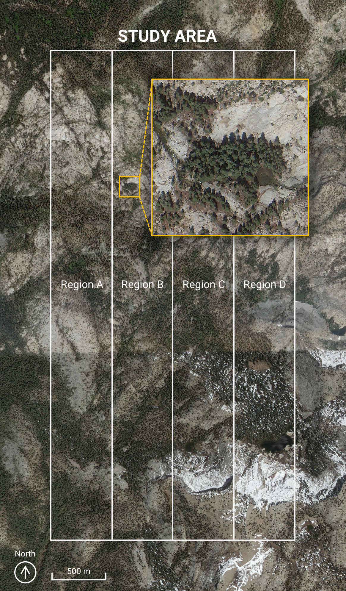

# Yosemite Tree Dataset
Yosemite Tree Dataset is a benchmark dataset for tree counting from aerial images. The dataset is available to download through [this link](https://drive.google.com/drive/folders/1NWAqslICPoTS8OvT8zosI0R7cmsl6x9j?usp=sharing).

The study area is a 2262.5m x 4525.1m rectangular area (19200 x 38400 pixels in image).
We have labeled the position of each individual tree in the study area. There are totally 98,949 individual trees labeled.

### The recommended way to use the dataset
The study area is split into four regions of same size. Region B and D are used to train models to count trees.
Region A and C are used as the test set.

To evaluate the accuracy of your model
1. Cut Region A and Region C into smaller (eg. 960 x 960) blocks.
2. Predict the number of trees in each block.
3. Calculate the Mean Average Error (___MAE___) and Root Mean Square Error (___RMSE___).

### Copyright of the original images:
The original images are downloaded via Google Maps.
Imagery ©2021 Google, Maxar Technologies, USDA Farm Service Agency

### Disclaimer:
No warranty, expressed or implied, is made regarding accuracy, adequacy, completeness, legality, reliability or usefulness of any information.

